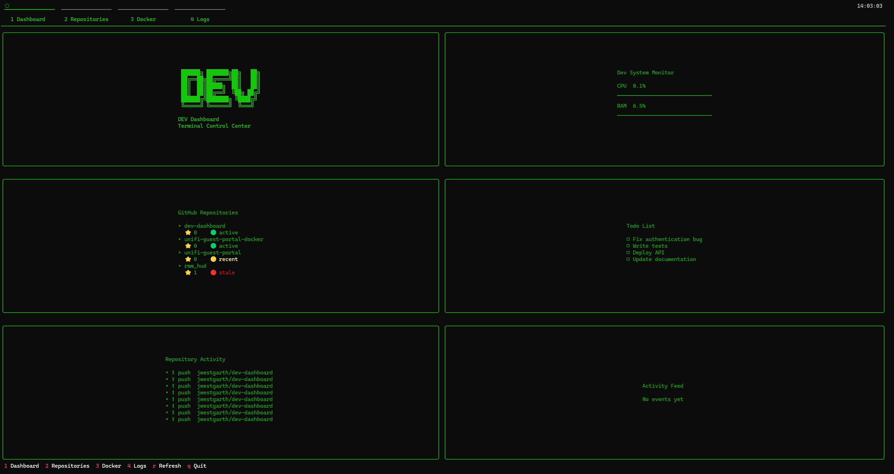

# DEV Dashboard

**Terminal Control Center for Developers**

A lightweight developer dashboard that runs directly in the terminal and provides a live overview of your development environment including GitHub activity, repositories, Docker containers, and system status.

Built using **Python**, **Docker**, and **Textual** to create a modern terminal UI.

---

## Screenshot



Example dashboard layout:

```
DEV Dashboard
Terminal Control Center

System Stats
GitHub Repositories
Repository Activity
Docker Containers
Todo List
```

---

## Features

### System Monitoring

* CPU usage
* RAM usage
* Disk usage
* Network statistics

### GitHub Integration

* View your repositories
* Repository activity feed
* Repo statistics and languages

### Docker Monitoring

* See running containers
* Container status overview

### Developer Workflow

* Todo list panel
* Repo activity panel
* Clean terminal UI layout

### Terminal UI

* Built with Textual
* Live updating panels
* Keyboard shortcuts
* Clean green terminal theme

---

## Architecture

```
DEV Dashboard
│
├── System Monitor
├── GitHub Repositories
├── Repository Activity
├── Docker Containers
└── Todo List
```

Each panel is implemented as a modular **Textual widget**, making the dashboard easy to extend.

---

## Requirements

* Python 3.11+
* Docker
* GitHub Personal Access Token

---

## Installation

Clone the repository:

```
git clone https://github.com/jwestgarth/dev-dashboard.git
cd dev-dashboard
```

---

## Configuration

Create a `.env` file in the project root:

```
GITHUB_TOKEN=your_github_personal_access_token
```

You can generate a token here:

https://github.com/settings/tokens

Recommended permissions:

```
read:user
repo
```

---

## Run with Docker (Recommended)

```
docker compose up -d
docker exec -it dev-dashboard python main.py
```

The dashboard will start directly in your terminal.

---

## Run Without Docker

Install dependencies:

```
pip install -r requirements.txt
```

Run the dashboard:

```
python app/main.py
```

---

## Keyboard Shortcuts

| Key | Action         |
| --- | -------------- |
| `q` | Quit dashboard |
| `r` | Refresh panels |

---

## Project Structure

```
dev-dashboard
│
├── app
│   ├── main.py
│   └── modules
│       ├── docker_panel.py
│       ├── github_repos_panel.py
│       ├── logo_panel.py
│       ├── repo_panel.py
│       ├── system_panel.py
│       └── todo_panel.py
│
├── docker-compose.yml
├── Dockerfile
├── requirements.txt
└── README.md
```

---

## Roadmap

Planned improvements:

* Live commit feed
* Repo health indicators
* Docker container CPU usage
* Plugin system for custom panels
* Interactive controls
* Theme support
* CPU activity graphs

---

## Contributing

Contributions are welcome.

1. Fork the repository
2. Create a feature branch
3. Commit your changes
4. Open a pull request

---

## License

MIT License

---

## Author

Created by **Jack Westgarth**

GitHub: https://github.com/jwestgarth

